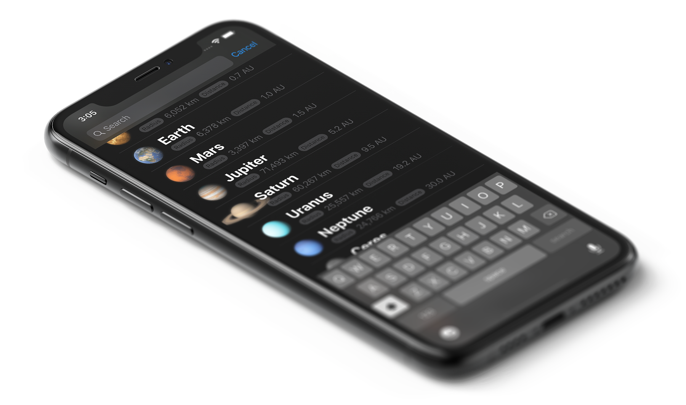

# SwiftUI Search Bar in Navigation Bar
🔍 SwiftUI search bar in the navigation bar.


<p align="center"></p>

Complementary repository for article [**SwiftUI Search Bar in the Navigation Bar**]. For more details on motivations and implementation please refer to the full article, or lookup the basic usage example below otherwise.

```Swift
struct ContentView: View
{
    
    var planets =
        ["Mercury", "Venus", "Earth", "Mars", "Jupiter", "Saturn", "Uranus", "Neptune"] +
        ["Ceres", "Pluto", "Haumea", "Makemake", "Eris"]
    
    @ObservedObject var searchBar: SearchBar = SearchBar()
    
    var body: some View {
        NavigationView {
            List {                
                ForEach(
                    planets.filter {
                        searchBar.text.isEmpty ||
                        $0.localizedStandardContains(searchBar.text)
                    },
                    id: \.self
                ) { eachPlanet in
                    Text(eachPlanet)
                }
            }
                .navigationBarTitle("Planets")
                .add(self.searchBar)
        }
    }
}
```


## License

> Licensed under the [**MIT License**](https://en.wikipedia.org/wiki/MIT_License).


[**SwiftUI Search Bar in the Navigation Bar**]: http://blog.eppz.eu/swiftui-search-bar-in-the-navigation-bar
[`SearchBar/SearchBar.swift`]: SwiftUI_Search_Bar_in_Navigation_Bar/SearchBar/SearchBar.swift
[`ContentView.swift`]: SwiftUI_Search_Bar_in_Navigation_Bar/ContentView.swift
